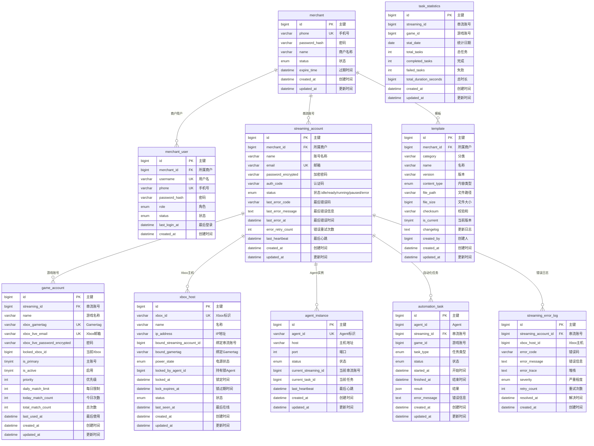

# Bend Platform 数据库 ER 图

## Mermaid ER Diagram



## 表关系说明

```
┌─────────────────────────────────────────────────────────────────────────────┐
│                           Bend Platform 数据库 ER 图                          │
├─────────────────────────────────────────────────────────────────────────────┤
                                                                             │
│                          merchant (商户)                                     │
│                              │                                               │
│           ┌──────────────────┼──────────────────┐                            │
│           │                  │                  │                            │
│           ▼                  ▼                  ▼                            │
│    merchant_user      streaming_account       template                       │
│    (商户用户)            (串流账号)            (模板)                        │
│           │                  │                                               │
│           │                  ├─── game_account (游戏账号)                     │
│           │                  │                                               │
│           │                  ├─── xbox_host (Xbox主机)                       │
│           │                  │                                               │
│           │                  ├─── agent_instance (Agent)                    │
│           │                  │                                               │
│           │                  ├─── automation_task (自动化任务)                │
│           │                  │                                               │
│           │                  └─── streaming_error_log (错误日志)             │
│           │                                                               │
│           └─── (其他商户相关)                                               │
│                                                                             │
└─────────────────────────────────────────────────────────────────────────────┘
```

## 核心表说明

| 表名 | 说明 | 关联表 |
|------|------|--------|
| **merchant** | 商户主表 | 1:N merchant_user, streaming_account, template |
| **streaming_account** | 串流账号（核心） | 1:N game_account, xbox_host, agent_instance, automation_task, streaming_error_log |
| **game_account** | 游戏账号 | 属于某个串流账号 |
| **xbox_host** | Xbox主机 | 绑定到串流账号，含分布式锁字段 |
| **agent_instance** | Agent实例 | 绑定到串流账号 |
| **automation_task** | 自动化任务 | 关联串流账号和游戏账号 |
| **streaming_error_log** | 错误日志 | 关联串流账号和Xbox主机 |
| **template** | 模板表 | 属于商户 |

## 关键字段说明

### streaming_account.status (串流账号状态)
- `idle` - 空闲
- `ready` - 就绪（Token刷新+Xbox锁定成功）
- `running` - 运行中（自动化执行中）
- `paused` - 暂停
- `error` - 异常

### xbox_host.locked_by_agent_id (分布式锁)
- NULL - 未被占用
- 有值 - 被某个Agent锁定

### error.severity (错误严重程度)
- `HIGH` - 需要商户介入
- `MEDIUM` - Agent自动重试
- `LOW` - 自动处理
